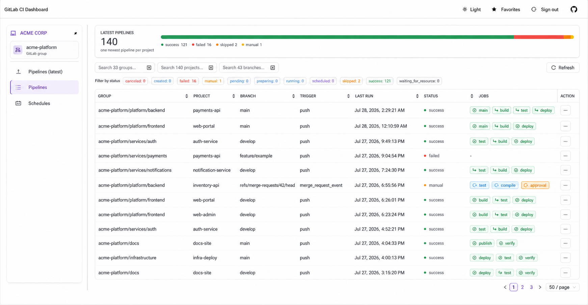
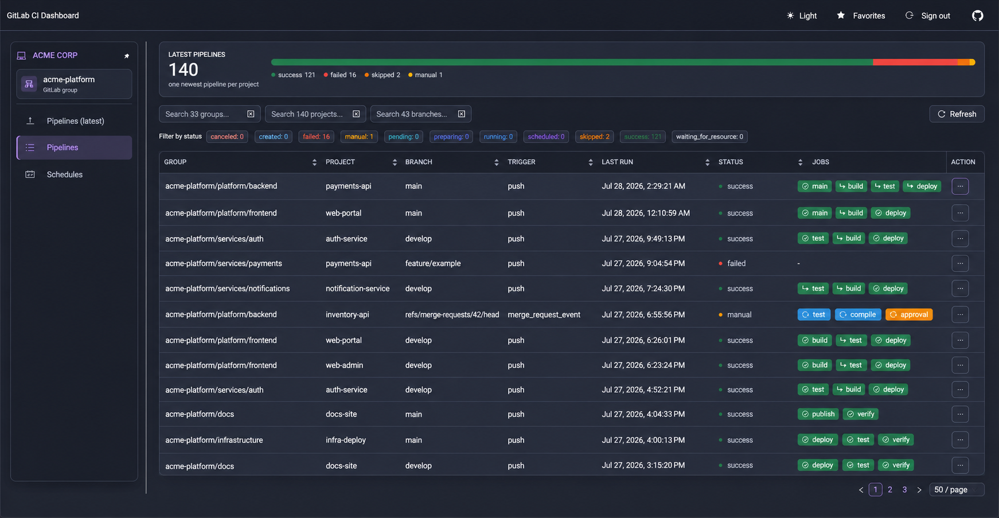
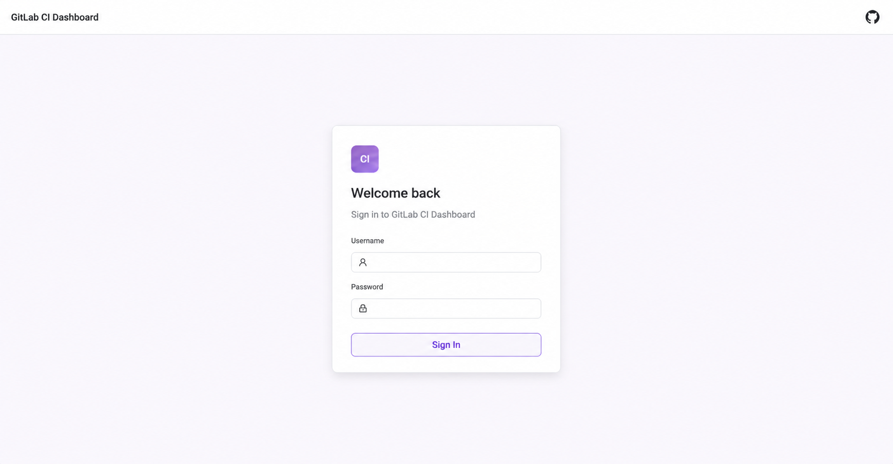

# Gitlab CI Dashboard

[](https://hub.docker.com/r/larscom/gitlab-ci-dashboard)
[](https://github.com/larscom/gitlab-ci-dashboard/actions/workflows/workflow.yml)
[](https://opensource.org/licenses/MIT)

## Preview

### Pipeline dashboard





### Optional login




<br />

Gitlab CI Dashboard will provide you with a **global** overview of pipelines, runners, and their statuses within a
single group.
The default functionality of Gitlab is limited at the project level. This can become hard to manage when you have a lot
of
projects, potentially resulting in undetected failed pipelines.

## 👉 [Demo](https://gitlab-ci-dashboard.larscom.nl)

<br />

## 🚀 Highlights

- View all pipeline statuses per group (e.g: failed/canceled/success)
- View group runners, availability, execution state, and currently running jobs
- You won't get rate limited by the Gitlab API, due to server-side caching
- Communication to the Gitlab API happens only server side
- Only 1 `read only` token is needed to serve a whole team
  - Optionally use a `read/write` token to perform actions like restarting failed pipelines, create new pipelines or
    cancel pipelines.

## ✅ Features

- [x] Overview of all latest pipeline statuses within a group
- [x] Overview of all pipeline statuses within a group
- [x] Read-only overview of group runners and their active jobs
- [x] Navigate to Gitlab
- [x] Shows jobs and their status per pipeline
- [x] Download artifacts from jobs directly
- [x] Search for projects within a group
- [x] Filter pipelines by status
- [x] Filter pipelines by projects and topic
- [x] Filter pipelines by failed jobs
- [x] Add projects to favorites
- [x] Start a new pipeline (requires read/write API token)
- [x] Restart failed pipelines (requires read/write API token)
- [x] Cancel pipelines (requires read/write API token)

## 📒 Features (PLANNED)

- [ ] Overview of all registries (container/package) within a group
- [ ] ... suggestions are welcome

## ⚡️ Requirements

- Gitlab server (v4 API)
- API token (read only or read/write)
- To use the Runners page, the token must include runner read access (`manage_runner` on GitLab versions that require
  it), and its user must have an Owner, Auditor, or suitable custom runner-management role in the group. Active job
  details are shown only for projects the token user can access.
- Docker

## 💡 Getting started

1. Generate a `read_api` or `api` access token in Gitlab, depending on your requirements (
   e.g: https://gitlab.com/-/profile/personal_access_tokens)

   The read-only Runners page requires the `manage_runner` token scope and suitable group access (Owner, Auditor, or a
   custom role with `admin_runners`). Active jobs are shown only for projects the token user can access.


2. Run docker with the required environment variables (GITLAB_BASE_URL, GITLAB_API_TOKEN)

```bash
docker run \
  -p 8080:8080 \
  -e GITLAB_BASE_URL=https://gitlab.com \
  -e GITLAB_API_TOKEN=my_token \
  larscom/gitlab-ci-dashboard:latest
```

Or you can run it with a TOML configration file

```bash
docker run \
  -p 8080:8080 \
  -v ./config.toml:/app/config.toml \
  larscom/gitlab-ci-dashboard:latest
```

3. Dashboard should be available at: http://localhost:8080/ showing (by default) all available groups and their
   projects

### Runner monitoring permissions

The read-only Runners page uses GitLab's group runners and runner jobs endpoints. The token user must be an Owner or
Auditor of the group, or have a custom role with `admin_runners`. The token must also be allowed to read runner
information (GitLab documents the `manage_runner` scope for these endpoints). Active job details are limited to projects
the token user can access.

## 👉 Create/Cancel/Retry Pipelines

You are able to perform write operations like creating,canceling,retrying pipelines, but you need to set the environment
variable: `API_READ_ONLY` to `false` and provide a valid `read/write` access token.

## 👉 Hide the 'write' operations button

You are able to hide the ellipsis (...) when you just want to use `READ_ONLY` mode. Set the `UI_HIDE_WRITE_ACTIONS` to
true.

## ⏰ Prometheus

Prometheus metrics are exposed on the following endpoint

> http://localhost:8080/metrics/prometheus

## 🔌 Configration

You have the option to set the configuration via environment variables or a TOML file.
A TOML file takes precedence over environment variables, except for the `RUST_LOG` variable.

### Load from TOML file

> An example TOML file can be found inside the `./api` folder.

Mount the `config.toml` inside the container (`/app/config.toml`)

```bash
docker run \
  -p 8080:8080 \
  -v ./config.toml:/app/config.toml \
  larscom/gitlab-ci-dashboard:latest
```

## 📜 Custom CA certificate

If you are running a gitlab instance that is using a TLS certificate signed with a private CA you are able to provide that CA as mount (PEM encoded)

This is needed when the dashboard backend is unable to make a connection to the gitlab API over HTTPS.

Mount the `ca.crt` inside the container (`/app/certs/ca.crt`)

```bash
docker run \
  -p 8080:8080 \
  -e GITLAB_BASE_URL=https://gitlab.com \
  -e GITLAB_API_TOKEN=my_token \
  -v ./ca.crt:/app/certs/ca.crt \
  larscom/gitlab-ci-dashboard:latest
```

### Troubleshooting

If you are still unable to connect with a custom CA cert, be sure that the gitlab server certificate contains a valid SAN (Subject Alternative Name)

If there is a mismatch the HTTP client is still unable to make a proper connection.

## 🔀 Reverse proxy

Below is a working config for a `Caddy` reverse proxy server to serve the dashboard on a different path.

```bash
:80 {
    handle_path /my-custom-path* {
        reverse_proxy gitlab-ci-dashboard:8080
    }
}
```

The dashboard should now be available at: https://example.com/my-custom-path

## 🌍 Environment variables

| Variable                          | Type   | Description                                                                                                                        | Required | Default        |
| --------------------------------- | ------ | ---------------------------------------------------------------------------------------------------------------------------------- | -------- | -------------- |
| GITLAB_BASE_URL                   | string | The base url to the Gitlab server (e.g: https://gitlab.com)                                                                        | yes      |                |
| GITLAB_API_TOKEN                  | string | A readonly or read/write access token generated in Gitlab (see: https://gitlab.com/-/profile/personal_access_tokens)               | yes      |                |
| APP_LOGIN_USERNAME                | string | Dashboard login username. Authentication is enabled when this and `APP_LOGIN_PASSWORD` are set                                     | no       |                |
| UI_COMPANY_NAME                   | string | Company name displayed at the top of the expandable sidebar                                                                        | no       | Company        |
| APP_LOGIN_PASSWORD                | string | Dashboard login password. Store this only in the server environment                                                                | no       |                |
| APP_LOGIN_SECURE_COOKIE           | bool   | Send the login cookie over HTTPS only. Enable this when TLS is configured                                                          | no       | false          |
| GITLAB_GROUP_ONLY_IDS             | string | Provide a comma seperated string of group ids which will only be displayed (e.g: 123,789,888)                                      | no       |                |
| GITLAB_GROUP_SKIP_IDS             | string | Provide a comma seperated string of group ids which will be ignored (e.g: 123,789,888)                                             | no       |                |
| GITLAB_GROUP_ONLY_TOP_LEVEL       | bool   | Show only top level groups, projects in sub groups will be shown inside the top level groups (see: GITLAB_GROUP_INCLUDE_SUBGROUPS) | no       | true           |
| GITLAB_GROUP_INCLUDE_SUBGROUPS    | bool   | Whether to include subgroup projects whenever projects are fetched for a specific group                                            | no       | true           |
| GITLAB_GROUP_CACHE_TTL_SECONDS    | int    | Expire after write time in seconds for groups (cache)                                                                              | no       | 300            |
| GITLAB_PROJECT_SKIP_IDS           | string | Provide a comma seperated string of project ids which will be ignored (e.g: 123,789,888)                                           | no       |                |
| GITLAB_PROJECT_CACHE_TTL_SECONDS  | int    | Expire after write time in seconds for projects (cache)                                                                            | no       | 300            |
| GITLAB_PIPELINE_CACHE_TTL_SECONDS | int    | Expire after write time in seconds for pipelines (cache)                                                                           | no       | 30             |
| GITLAB_PIPELINE_HISTORY_DAYS      | int    | How far back in time (days), it should fetch pipelines from gitlab (pipelines tab only)                                            | no       | 5              |
| GITLAB_BRANCH_CACHE_TTL_SECONDS   | int    | Expire after write time in seconds for branches (cache)                                                                            | no       | 60             |
| GITLAB_SCHEDULE_CACHE_TTL_SECONDS | int    | Expire after write time in seconds for schedules (cache)                                                                           | no       | 300            |
| GITLAB_RUNNER_CACHE_TTL_SECONDS   | int    | Expire after write time in seconds for the group runner list                                                                        | no       | 60             |
| GITLAB_RUNNER_DETAIL_CACHE_TTL_SECONDS | int | Expire after write time in seconds for self-hosted runner metadata such as tags                                                   | no       | 300            |
| GITLAB_RUNNER_JOB_CACHE_TTL_SECONDS | int  | Expire after write time in seconds for active jobs handled by runners                                                               | no       | 15             |
| GITLAB_JOB_CACHE_TTL_SECONDS      | int    | Expire after write time in seconds for jobs (cache)                                                                                | no       | 5              |
| GITLAB_ARTIFACT_CACHE_TTL_SECONDS | int    | Expire after write time in seconds for artifacts (cache)                                                                           | no       | 1800           |
| API_READ_ONLY                     | bool   | If true, you are not able to perform 'write' operations like retrying a pipeline                                                   | no       | true           |
| UI_HIDE_WRITE_ACTIONS             | bool   | If true, the ellipsis action button (...) is hidden, handy if you want to use this application in read-only mode                   | no       | false          |
| UI_PAGE_SIZE_OPTIONS              | string | Provide a comma seperated string of page sizes. This is the dropdown of available page sizes inside the paginator of the tables    | no       | 10,20,30,40,50 |
| UI_DEFAULT_PAGE_SIZE              | int    | The default page size which should be selected for the paginator                                                                   | no       | 10             |
| SERVER_LISTEN_IP                  | string | The IP address where the web server should listen on                                                                               | no       | 0.0.0.0        |
| SERVER_LISTEN_PORT                | int    | The port where the web server should listen on                                                                                     | no       | 8080           |
| SERVER_WORKER_COUNT               | int    | The amount of worker threads the web server should have                                                                            | no       | CPU specific   |
| RUST_LOG                          | string | The log level of the application, set to "debug" to enable debug logging                                                           | no       | info           |
