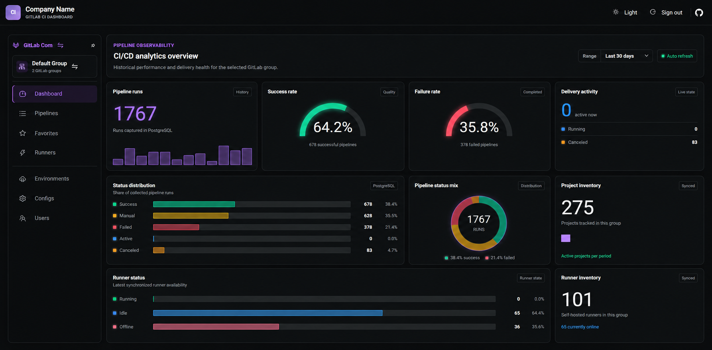
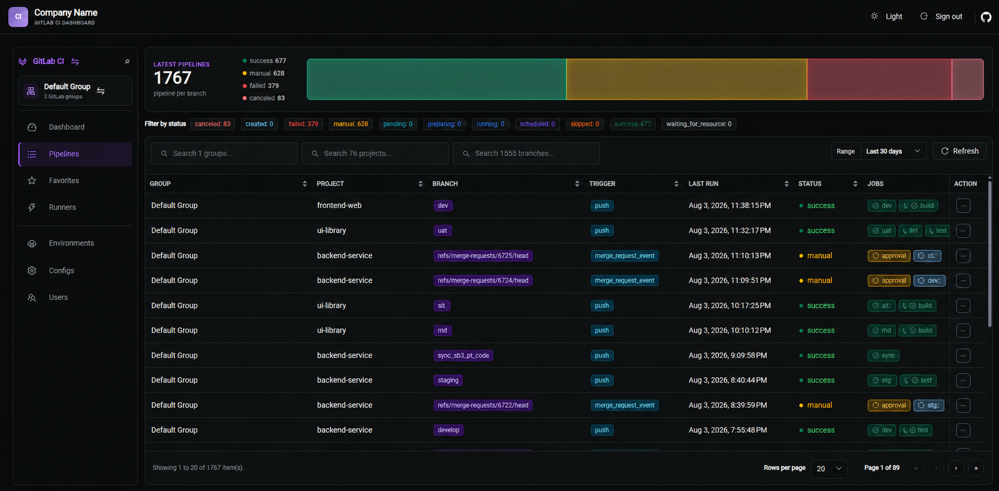
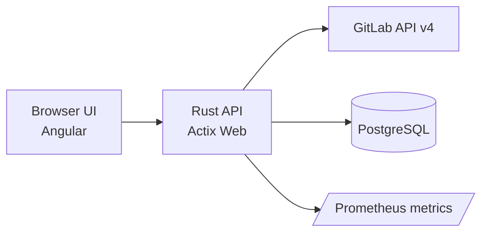

# GitLab CI Dashboard

[](https://github.com/andjoy404/gitlab-ci-dashboard/actions/workflows/workflow.yml)
[](https://opensource.org/licenses/MIT)
[](docker-compose.yml)
[](package.json)
[](api/Cargo.toml)

Centralized GitLab group observability for pipelines, runners, jobs, and analytics in one dashboard.

## Why this dashboard

GitLab works well per project, but large groups need cross-project visibility to catch delivery issues fast.
This dashboard gives your team a single place to monitor pipeline health, investigate failures, and track runners.

## Preview

### Dashboard



### Pipeline table



### Optional login


## Feature highlights

- Group-wide pipeline status overview (success, failed, canceled, active, manual)
- Runner visibility with availability and running jobs
- Fast dashboards backed by PostgreSQL analytics storage and background sync
- Server-side GitLab API communication and caching
- Optional write operations (retry, cancel, create pipeline)
- Favorites, topic filters, branch filters, status filters, project search
- Download job artifacts directly from the UI

## Architecture snapshot



## Quick start

### 1) Prepare token

GitLab UI labels vary by version/edition. Access token pages are usually here:

- User settings -> Access Tokens
- Group settings -> Access Tokens
- Project settings -> Access Tokens

Recommended scopes:

- Read-only dashboard: `read_api`
- Write actions (retry/cancel/create): `api`
- Runner visibility: `manage_runner` plus suitable group role (Owner, Auditor, or custom role with `admin_runners`)

Active runner-job details are limited to projects the token user can access.

### 2) Configure runtime file

Copy the template and edit values for your environment:

```bash
cp api/config.example.toml api/config.toml
```

Set at minimum:

- `security.environment_token_encryption_key` (64 hex chars)
- `database.url` (when analytics is enabled)

### 3) Start with Docker Compose

```bash
# Build and start from local source
docker compose up -d --build

# Or start using the configured image tag
docker compose up -d
```

Open: http://localhost:8080/

### 4) First login

Bootstrap account (created if `app_users` is empty):

- Username: `admin`
- Password: `admin`

You are forced to change this password on first login.

### 5) Add GitLab environments

After login, add GitLab environment and token entries in the dashboard UI.

Environment tokens are validated against GitLab when you save them, so invalid or unauthorized tokens fail fast with a clear error.

## Authentication and security

- Users are stored in PostgreSQL (`app_users`) with Argon2 hashes.
- Admin username/password are no longer stored in runtime config.
- API access is restricted until mandatory first-login password change is completed.
- Environment tokens are encrypted using `security.environment_token_encryption_key`.
- Environment tokens are checked against GitLab on save, which prevents storing a token that cannot access the configured instance.

## Runners permission model

The Runners page uses GitLab group runners and runner jobs endpoints.

- Group role: Owner, Auditor, or custom role with `admin_runners`
- Token scope: `manage_runner` (where required by your GitLab version)
- Job visibility depends on project access of the token user

## Write operations mode

Enable write actions in runtime config:

- `ui.read_only = false`

Hide the write-action menu while remaining read-only:

- `ui.hide_write_actions = true`

## Analytics persistence

With Compose, PostgreSQL is included and analytics persistence is enabled by default.

- Backend runs embedded migrations on startup
- Background synchronization updates analytics datasets
- Retention is controlled by `analytics.retention_days` (default `30`)

For non-Compose deployments, analytics remains disabled unless:

- `analytics.enabled = true`
- `database.url` is configured

## Runtime configuration

Runtime configuration file:

- `api/config.toml`

Template/reference:

- `api/config.example.toml`

### Supported keys

| Key | Type | Description | Required | Default |
| --- | --- | --- | --- | --- |
| `server.listen_ip` | string | Network interface address for the web server | no | `0.0.0.0` |
| `server.listen_port` | int | Port for the web server | no | `8080` |
| `server.worker_count` | int | Number of worker threads | no | `4` |
| `security.environment_token_encryption_key` | string | 64 hex chars used to encrypt GitLab tokens stored in DB | yes | |
| `authentication.secure_cookie` | bool | Use secure cookies when TLS is enabled (optional `[authentication]`) | no | `false` |
| `database.url` | string | PostgreSQL connection URL for analytics persistence | yes if analytics enabled | |
| `database.max_connections` | int | Maximum DB pool connections | no | `10` |
| `analytics.enabled` | bool | Enable PostgreSQL-backed analytics persistence | no | `true` |
| `analytics.sync_interval_seconds` | int | Background sync interval for analytics | no | `300` |
| `analytics.retention_days` | int | Days of analytics history to keep | no | `30` |
| `cache.group_ttl_seconds` | int | Group cache TTL | no | `300` |
| `cache.project_ttl_seconds` | int | Project cache TTL | no | `300` |
| `cache.branch_ttl_seconds` | int | Branch cache TTL | no | `60` |
| `cache.job_ttl_seconds` | int | Job cache TTL | no | `60` |
| `cache.pipeline_ttl_seconds` | int | Pipeline cache TTL | no | `300` |
| `cache.schedule_ttl_seconds` | int | Schedule cache TTL | no | `300` |
| `cache.runner_ttl_seconds` | int | Runner list cache TTL | no | `60` |
| `cache.runner_detail_ttl_seconds` | int | Runner detail cache TTL | no | `300` |
| `cache.runner_job_ttl_seconds` | int | Runner job cache TTL | no | `15` |
| `cache.artifact_ttl_seconds` | int | Artifact cache TTL | no | `1800` |
| `pipeline.history_days` | int | Number of days to fetch pipeline history | no | `30` |
| `ui.read_only` | bool | Disable write operations in the dashboard | no | `true` |
| `ui.hide_write_actions` | bool | Hide write action button in read-only mode | no | `false` |
| `ui.page_size_options` | array | Available table page sizes | no | `[10, 20, 30, 40, 50]` |
| `ui.default_page_size` | int | Default page size | no | `10` |

## Custom CA certificate

If your GitLab TLS cert is signed by a private CA, mount a PEM CA cert into the container:

```bash
cat > docker-compose.override.yml <<'EOF'
services:
  gitlab-ci-dashboard:
    volumes:
      - ./ca.crt:/app/certs/ca.crt:ro
EOF

docker compose up -d --build
```

If TLS still fails, verify server certificate SAN (Subject Alternative Name) matches the URL.

## Reverse proxy (Caddy example)

```caddy
:80 {
  handle_path /my-custom-path* {
    reverse_proxy gitlab-ci-dashboard:8080
  }
}
```

Result URL: `https://example.com/my-custom-path`

## Metrics

Prometheus endpoint:

- http://localhost:8080/metrics/prometheus

## Environment variables

- `RUST_LOG` (optional): set backend log level, for example `RUST_LOG=debug`

## Releases

Release notes and change history are published on GitHub Releases:

- https://github.com/andjoy404/gitlab-ci-dashboard/releases
